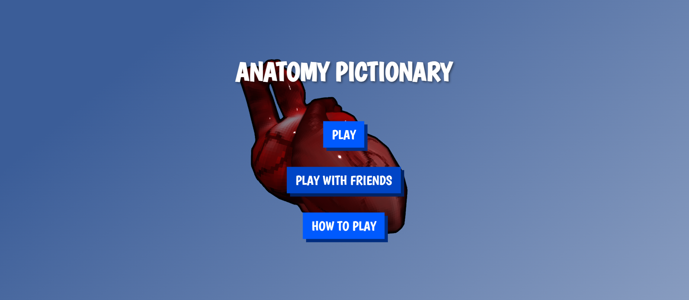
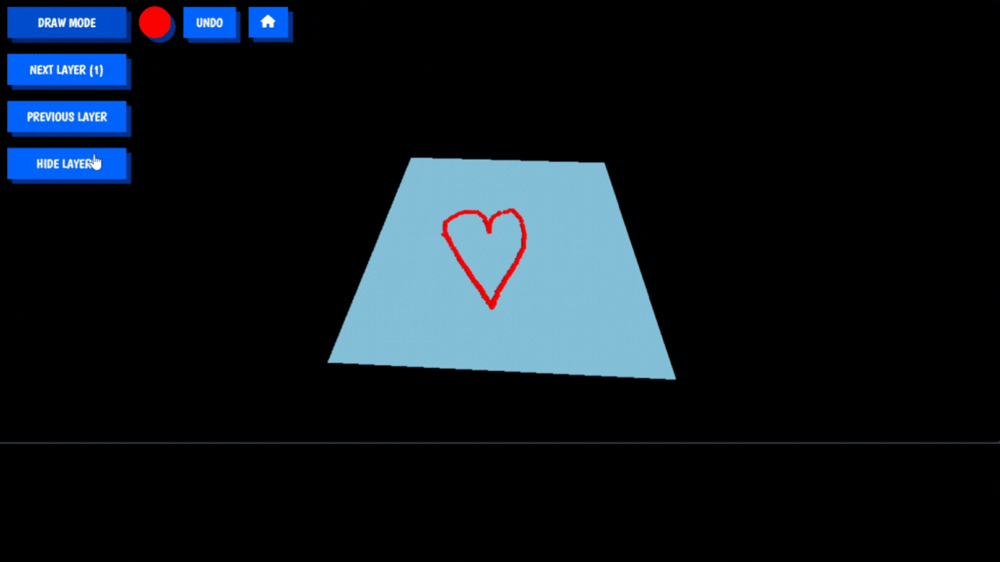
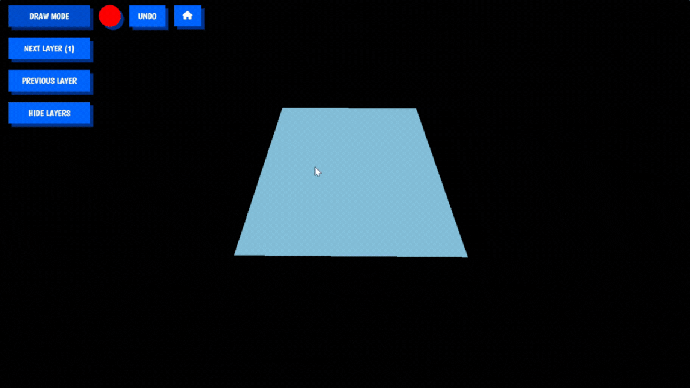

# my-threejs-webxr-drawing

This project is an Anatomy Pictionary. You can play "solo" where you only need your pc to draw and people around can try to guess. You can also "play with friends", but the project (multiplayer aspect) isn't hosted somewhere. All you'd have to do is find a host so that everyone can play. However, you can still test this fully functional mode on your own computer or with people on the same network. This project is also cross-platform between pc and phones.

## Installation

Install [Node.js](https://nodejs.org)

- Clone or download repo
- run `npm install` : fetches and install all dependencies
- `npm run build` : packages all code and resources into the `dist` folder

## Usage

1. Ensure you have Node.js installed. You can download it from [nodejs.org](https://nodejs.org/).
2. To play with people on the same network you have to replace the VITE_SERVER_HOST variable with your ip adress in the .env file at the root of the project
3. Open your terminal and navigate to the project directory.
```bash
node server.js
npm run dev
```
4. Open your web browser and go to `http://localhost:5173` to see the application in action.

## Alternative

You can play without installing anything on this website : `https://nalhab.github.io/my-threejs-webxr-drawing/`, but as mentioned GitHub can not host a node server so all you can do on this link is the "solo" mode. When entering the website you will have to wait a bit so your browser downloads all the needed resources.

## How to play

On the play page (solo or with friends), you have differents options and possibilities to enhance your drawing experience:

- **Draw Mode button**: Allows the user to switch between the draw mode and move mode, where in move mode the left clicks let the user moves in the scene instead of putting spheres.
- **Next/Previous Layer button**: Allows the user to switch between the planes to add relief to the drawing.
- **Hide Layers button**: Allows the user to hide all the planes to better see the drawing.
- **Color Picker button**: A color picker to change the color of the spheres.
- **Undo button**: Cancel the last trace of the drawer.
- **Home button**: Use this button to get back the home page (stops the party if in multiplayer).

The difference in multiplayer between the drawer and guessers is that guessers only have access to **Hide Layers button** and **Home button**.

## Features

- **Solo Mode**: Draw on your own and let others guess.
- **Multiplayer Mode**: Play with friends by hosting the server on your own machine.
- **Music**: There is music on the home page (browser may block autoplay so you have to click on the page to trigger it), there is also a sound when a sphere is placed.

### Socket Events for Multiplayer Mode

The following is a list of socket events handled for the multiplayer mode:

1. **Connection Events**:
   - `connection`: Triggered when a new client connects to the server.
   - `disconnect`: Triggered when a client disconnects from the server.

2. **Room Management**:
   - `joinRoom`: Allows a client to join a specific room.
     - **Parameters**: `roomName` (string) - The name of the room to join.
   - `roomsList`: Emits the list of all available rooms to the clients.
   - `leaveRoom`: Handle when a player leave a room to update the rooms and roles if necessary.

3. **Player Management**:
   - `storePlayerId`: Stores the player's ID in the socket.
     - **Parameters**: `playerId` (string) - The ID of the player.
   - `getPlayersIds`: Requests the list of player IDs in the current room.
   - `playerData`: Emits the role and other data of the player to the client.
     - **Parameters**: `data` (object) - The data of the player including role.

4. **Game Events**:
   - `gameStarted`: Notifies clients that the game has started.
   - `gameEnded`: Notifies clients that the game has ended.
   - `draw`: Sends drawing data to all clients in the room.
     - **Parameters**: `data` (object) - The drawing data including position, color, and layer.
   - `nextLayer`: Notifies clients to move to the next drawing layer.
   - `previousLayer`: Notifies clients to move to the previous drawing layer.
  
## Examples







## Contributing

1. Fork the repository.
2. Create your feature branch (`git checkout -b feature/AmazingFeature`).
3. Commit your changes (`git commit -m 'Add some AmazingFeature'`).
4. Push to the branch (`git push origin feature/AmazingFeature`).
5. Open a Pull Request.

## Credits

This project uses  free models from SketchFab and musics from Mixkit.

## License

Distributed under the MIT License. See `LICENSE` for more information.

## Contact

Nathan - [Email](mailto:nathan.labernardiere@epita.fr)

Mathieu - [Email](mailto:mathieu.cimolai@epita.fr)

Project Link: [GitHub Repository](https://github.com/your-username/my-threejs-webxr-drawing)
